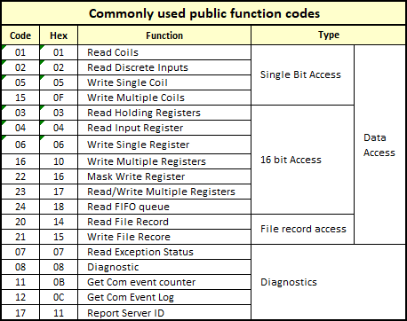

# 模块4150通过Modbus的使用说明
平台：Ubuntu/WSL  
主要库文件：libmodbus - modbus.h  
主要功能：编程实现ADAM4150的电平读/写（线圈存储区），脉冲写和计数（寄存器存储区）。

## Modbus
### 报文

数据地址Y(从站地址) XXXXX（00001-65536    16位）

RTU/ASCII的报文格式：从站地址（1 byte） + 功能码（1）+ 数据 + 校验位（2）

- 从站地址：coil - 输入1区，输出0区； 寄存器 - 输入3，输出4
- 数据为"具体干什么"。如：`21 FF` 是把33( DEC )地址置位。
- 应答异常码：83

### Modbus Poll

连接 - 设置串口的信息

读写定义 - 设置设备ID、读写位置

## ADAM

### 特性

- 线圈和地址都是断电

### 寄存器

- DO 0-7 地址0区的16-24（这里是编程用的协议地址， PLC 地址是从1开始）

**脉冲：**

- 4区的DO电平编写方式：设置L\H的时间、在Digital output mode（40086 ~ 40093）中置1。
- 4区的DO电平编写次数：在Set absolute pulse （40047 ~ 40062）设置，设置负值可以一直输出（还能计数）
- 线圈与寄存器读写的影响
    1. 若要再使用DI为线圈输出，则关闭寄存器的Digital output mode

**计数：**

- 4区的1~14为DI的计数，每个DI有两字节存储数据
- 滤波由Digital input filter low width（40094 ~ 40107）、Digital input filter high width（40108 ~ 40121）组成，单位是0.1 ms。
- 试出来的还可以的滤波：L:10 ms  H: 20 ms
- 计数清零在线圈段（0x）上，DI 0~6分别是：[34, 38, 42, …, 58]